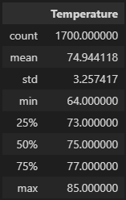

# Surfs Up Analysis

## Overview
Analysis of the summer and winter temperatures around a proposed location for a surf and ice cream shop. This analysis is to be provided to the stock holders to make a final decision for approval to commit funds to the project.

## Results

### June

### December

Key findings

* The avrage temperatue for summer and winter is statistically the same at 71 and 75 with standard deviations of 4 and 3 degrees respectively.
* The max temperatures for both months are also similar at 83 and 85. 
* Daily lows can be very chilly in December at 56 as compared to the low of 64 in June. December also has more chilly days indicated by first quartile of 69 degrees as compared to the first quartile value for June of 73.

## Summary

It appears that the temperatures are stable and constant throughout the year. This is great for year round surfing and ice cream sales. Caution should be given to the month of December because it may have a few days that may be too cold for surfing and ice cream while winter storms blow through.

Two additional queries i would recommend i precipitation and wind speeds. Rain could wash out the business and it is hard to enjoy surfing and eating ice cream during a hurricane!

The provide data set only contains station, temperatures, and precipitation. Requesting wind speed data could determine how windy it could get for surfers (bigger waves or unsafe conditions).

With the data given. It is possible to determine the percent of rainless days. Using the following query:

The historical percentage of rain free days for each month is:

Almost 40% of the days in June are rain free, December could be a concern!